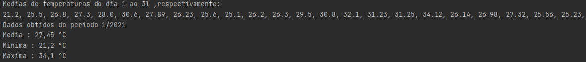

# Meteorologia

-----------------------------------
### Autor

Nome   | Matrícula
--------- | ------
Carlos Rafael Vasconcelos de Matos | 180118005

### Descrição 

Projeto feito para fazer consultas simples, a partir de dados que o usuario digitar(mês, ano e médias diárias de temperatura).
como; temperatura Media, Minima e Maxima.

# Executando projeto

---------------------------------------

### Ferramentas Necessárias 
- Windows

[JDK 15.0.2](https://jdk.java.net/15/)
[JAVA](https://www.java.com/pt-BR/download/ie_manual.jsp?locale=pt_BR)

- Linux

comand-line: 'sudo apt install default-jdk' and 'sudo apt install default-jre' 
Para verificar : 'java -version'

### Funções 

# Testando Funcionamento

-----------------------------------------

## Ações esperadas

### Entrada
[Arquivo Teste](src/Test)
- Mês/Ano    

- Média diária  

### Saída
 - Média  

 - Minima   

 - Relatorio   

# Possíveis Erros

-------------------------------

- Java é fortemente típada, entrada inválidas podem causar mal funcionamento do sistema.

- Versões diferentes do JDK e/ou JAVA, também podem trazer vários tipos de erros.

